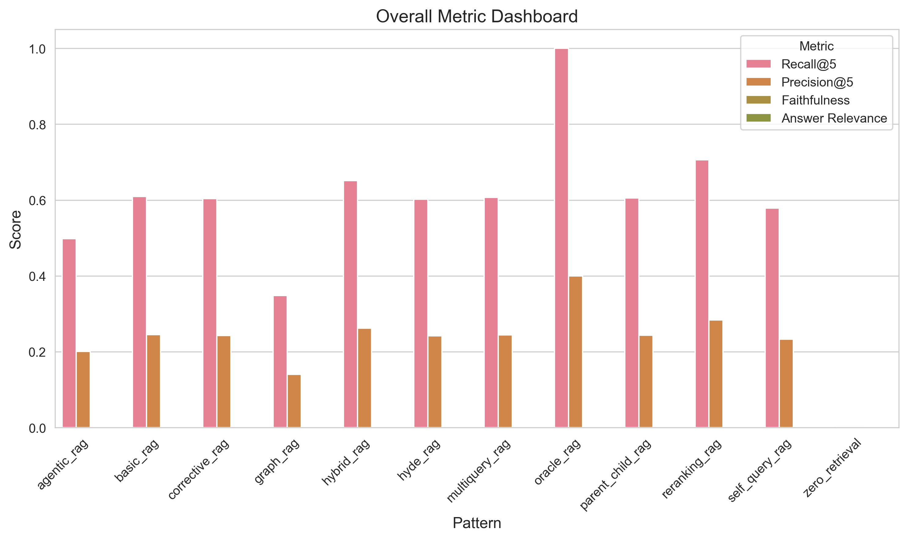
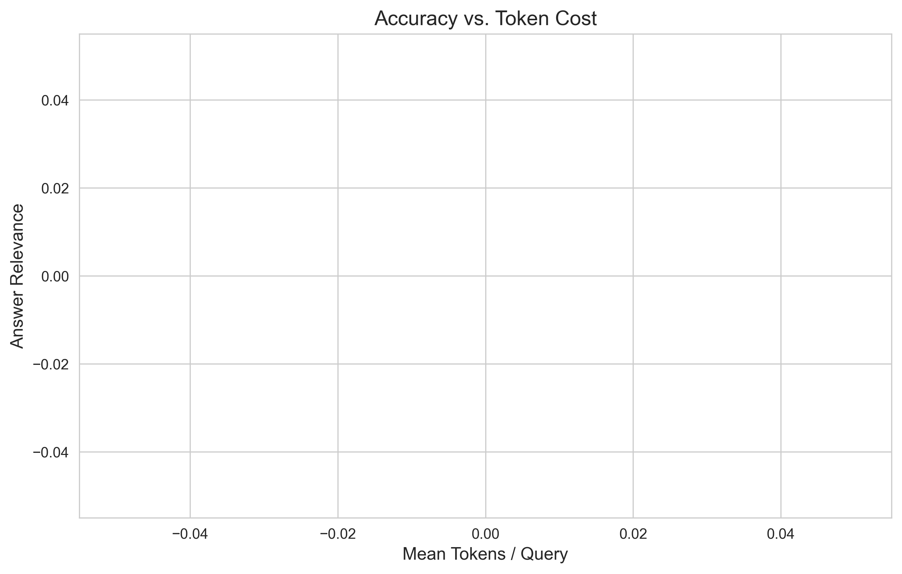
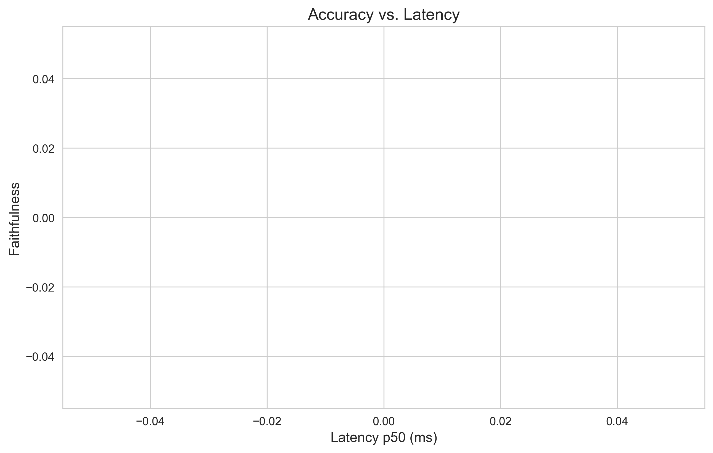
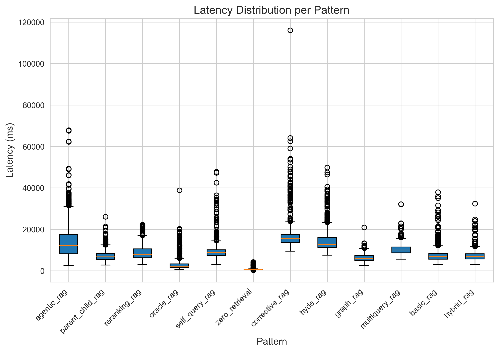
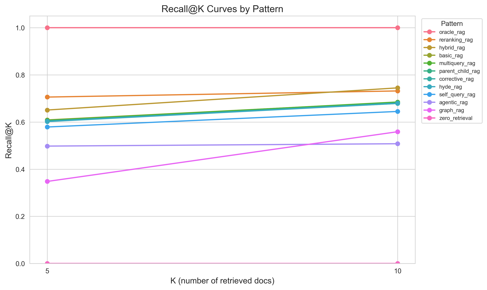
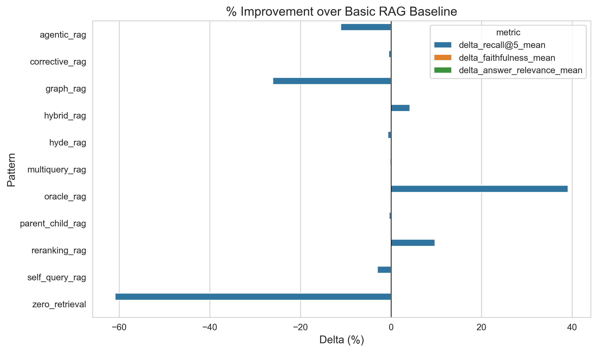
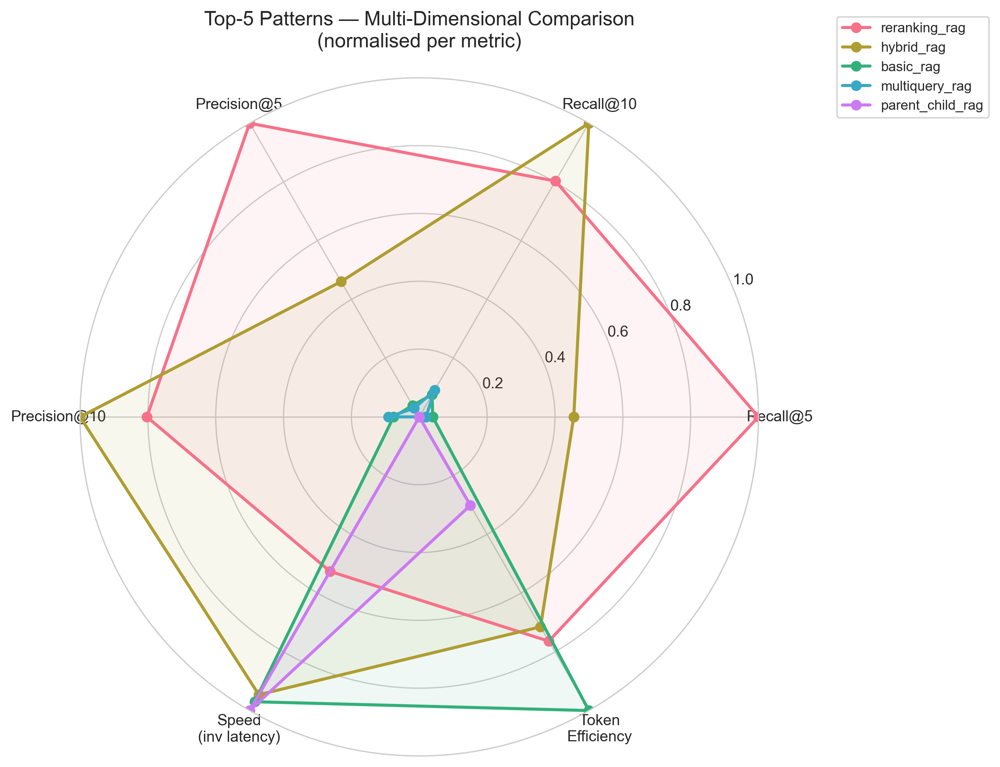
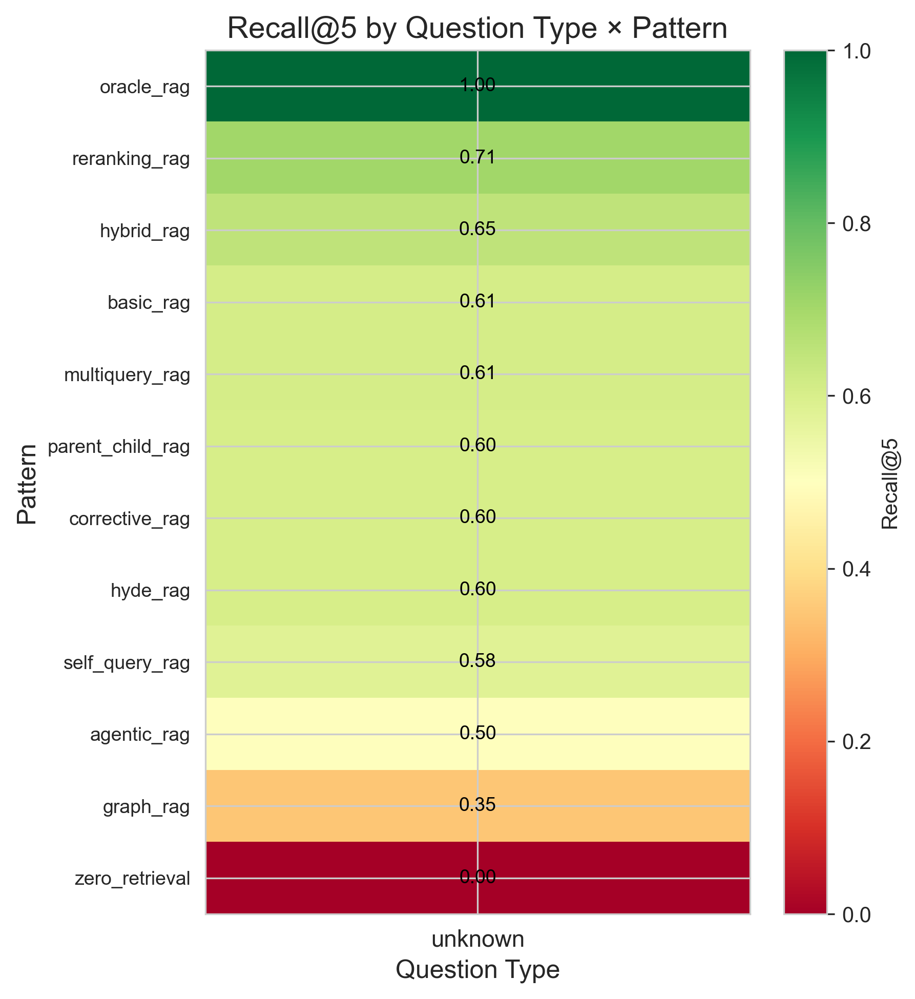

# RAG Architecture Benchmark

A reproducible, open-source benchmark comparing **10 RAG architectures + 2 baselines** on the same dataset, embedding model, and LLM. The only variable that changes between runs is the retrieval strategy.

---

## Key Findings

- **Re-ranking RAG** achieves the best Recall@5 (0.706) among real patterns — cross-encoder reranking consistently surfaces the right documents
- **Hybrid RAG** (BM25 + vector + RRF) wins on Recall@10 (0.745) with near-identical latency to Basic RAG
- **HyDE** is competitive on retrieval (Recall@5 0.602) but costs 2× the latency — the hypothesis generation step adds ~7s p50 vs. Basic RAG
- **Corrective RAG** adds significant token cost (3× tokens) with no meaningful retrieval gain over Basic RAG on this dataset
- **Agentic RAG** underperforms Basic RAG on retrieval metrics — the ReAct loop's iterative search does not compensate for its higher latency on straightforward multi-hop questions
- **Graph RAG** has the weakest Recall@5 (0.348) but highest Recall@10 gap (+0.211), suggesting it retrieves broadly but not precisely

---

## Results

> 📊 **[Interactive Dashboard](results/dashboard.html)** — sortable table, charts, and significance badges for all 12 patterns.

Evaluated on **500 questions** from HotpotQA distractor dev set, 3 runs each (`seed=42`, `temperature=0`).

| Pattern | Recall@5 | Recall@10 | Precision@5 | p50 Latency | Avg Tokens |
|---|---|---|---|---|---|
| Oracle *(upper bound)* | **1.000** | **1.000** | **0.400** | 2,210 ms | 178 |
| Re-ranking RAG | **0.706** | 0.732 | **0.284** | 7,947 ms | 858 |
| Hybrid RAG | 0.651 | **0.745** | 0.262 | 6,829 ms | 864 |
| Basic RAG | 0.609 | 0.684 | 0.245 | 6,774 ms | 833 |
| HyDE | 0.602 | 0.679 | 0.242 | 14,046 ms | 1,039 |
| Multi-query RAG | 0.607 | 0.685 | 0.244 | 10,000 ms | 952 |
| Parent-Child RAG | 0.605 | 0.679 | 0.243 | 6,707 ms | 913 |
| Corrective RAG | 0.604 | 0.681 | 0.243 | 15,596 ms | 2,415 |
| Self-Query RAG | 0.579 | 0.645 | 0.233 | 8,763 ms | 900 |
| Agentic RAG | 0.498 | 0.508 | 0.200 | 12,206 ms | 858 |
| Graph RAG | 0.348 | 0.559 | 0.140 | 5,964 ms | 786 |
| Zero-retrieval *(lower bound)* | 0.000 | 0.000 | 0.000 | 568 ms | 36 |

> Faithfulness, Answer Relevance, and Hallucination Rate (via RAGAS) — in progress.

---

## Charts

### Overall Dashboard


### Accuracy vs. Token Cost


### Accuracy vs. Latency


### Latency Distribution


### Recall@K Curves


### Improvement over Basic RAG Baseline


### Multi-Dimensional Comparison (Top 5 Patterns)


### Recall@5 by Question Type


---

## Controlled Variables

Every run uses identical values for all variables except the retrieval strategy:

| Variable | Value |
|---|---|
| Embedding model | `all-MiniLM-L6-v2` (384-dim) |
| Chunk size | 512 tokens, 50 overlap |
| Splitter | `RecursiveCharacterTextSplitter` |
| Vector store | FAISS `IndexFlatIP` (cosine via L2-normalized inner product) |
| LLM | `llama3.1:8b-instruct-q8_0` via Ollama |
| Temperature | 0.0 |
| Seed | 42 |
| Eval dataset | HotpotQA distractor dev — 500 dev / 2,000 test questions |

---

## Patterns

| ID | Pattern | Description |
|---|---|---|
| B0 | Zero-retrieval | LLM parametric knowledge only — lower bound |
| B1 | Basic RAG | Standard vector similarity retrieval |
| B2 | Oracle | Gold supporting facts injected directly — upper bound |
| P2 | Hybrid RAG | BM25 + vector with Reciprocal Rank Fusion (k=60) |
| P3 | Re-ranking RAG | FAISS top-20 → cross-encoder (`ms-marco-MiniLM-L-6-v2`) → top-5 |
| P4 | Multi-query RAG | LLM generates 3 query variants → union of results |
| P5 | HyDE | LLM generates hypothetical doc → embed → search |
| P6 | Parent-Child RAG | Retrieve child chunks (256 tok), return parent context (1024 tok) |
| P7 | Self-Query RAG | LLM extracts metadata filters from natural language query |
| P8 | Corrective RAG | Re-retrieves if <50% of chunks rated RELEVANT (up to 2 attempts) |
| P9 | Agentic RAG | ReAct loop with `search`, `lookup`, `answer` tools (max 5 iterations) |
| P10 | Graph RAG | Entity extraction → knowledge graph → community summaries |

---

## Setup

**Requirements:** Python 3.11, [Ollama](https://ollama.com) running locally.

```bash
# 1. Install dependencies
pip install -r requirements.txt

# 2. Pull the LLM
ollama pull llama3.1:8b-instruct-q8_0

# 3. (Optional) Set API keys for cloud LLM fallback
cp .env.example .env

# 4. Download dataset and build indexes
python scripts/prepare_dataset.py
python scripts/build_indexes.py

# 5. Verify setup
python scripts/verify_setup.py

# 6. Run a single pattern (dev mode = 50 questions)
python evaluation/run_eval.py --pattern basic_rag --run-id 1 --dev

# 7. Run the full benchmark
bash scripts/run_all.sh
```

**Fallback:** If local GPU is insufficient for Llama 8B, set `TOGETHER_API_KEY` in `.env` and update `config/config.yaml` to use `provider: together`.

---

## Repository Structure

```
config/           # config.yaml (all hyperparameters) + prompt templates
data/
  processed/      # test_questions.json, dev_questions.json (version-controlled)
  raw/            # original downloads (gitignored)
  faiss_index/    # FAISS vector store (gitignored, rebuilt by build_indexes.py)
rag_patterns/     # one file per RAG pattern, all implementing BaseRAG
evaluation/       # metrics.py, run_eval.py, logger.py
results/
  aggregated/     # comparison.csv (mean ± std across runs)
  charts/         # PNG (300 DPI) + SVG
scripts/          # data prep, index building, chart generation, run_all.sh
report/           # research report and blog draft
```

---

## Reproducing the Results

```bash
# Run all 12 patterns × 3 runs
bash scripts/run_all.sh

# Or run a specific pattern
python evaluation/run_eval.py --pattern reranking_rag --run-id 1 --config config/config.yaml

# Aggregate and regenerate charts
python scripts/aggregate_results.py --input results/raw/ --output results/aggregated/
python scripts/generate_charts.py --input results/aggregated/ --output results/charts/
```

All results are deterministic: same config → same output (`temperature=0`, `seed=42`).

---

## License

MIT
